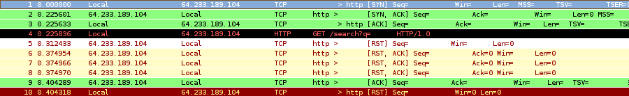
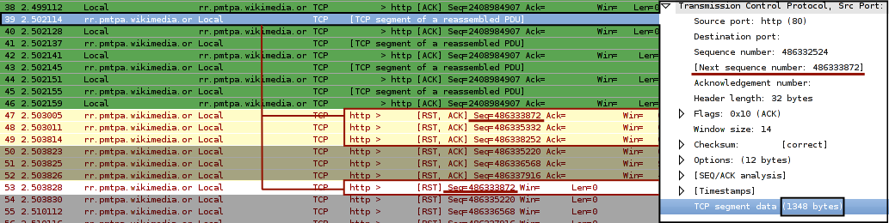
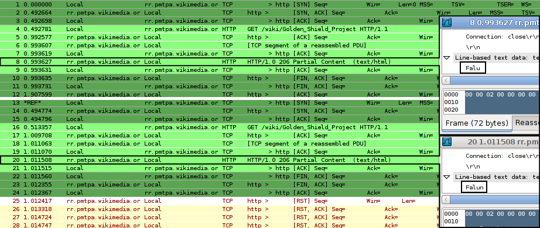
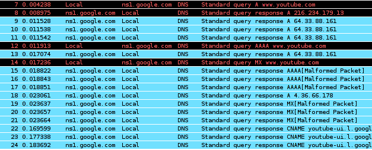

# GFW研究与诊断工具

在开始所有对GFW的细致研究之前，要先给大家介绍一下我们研究所需要的主要工具和典型方法。读者也可以留言推荐自己喜欢的工具。
一览：
* 监听和扫描：wireshark，tcpdump，nmap
* 应用层：nc，wget，curl，w3m
* 编程接口：libpcap/winpcap，libnids，libnet/raw sockets，snort，libnetfilter\*\(libipq\)/divert sockets

#### 监视和诊断工具
我们需要一些工具来进行一般性的人工流量监视，人工报文检查，因此需要一些用户界面的工具。

wireshark是报文监听的“业界标准”。建议以[非root帐号运行](http://wiki.wireshark.org/CaptureSetup/CapturePrivileges)wireshark。如果版本不支持，可以手动设置（linux）：
> 
```bash
addgroup --quiet --system wireshark
chown root:wireshark dumpcap
chmod u=rwxs,g=rx,o=r /usr/bin/dumpcap # dumpcap是wireshark的听包接口
usermod -G wireshark -a $USER # 将自己加入wireshark组
```

然后重新登录生效。[设置](http://wiki.wireshark.org/Lua#head-cc34cd978b51eb601a0e005647af2528fd946da1)一个lua后解析器从而能够自动标示GFW的伪造包。修改`/etc/wireshark/init.lua`，将`disable_lua = true`一行注释掉。将[gfw.lua](gfw.lua.md)复制到`~/.wireshark/init.lua`，并禁用TCP协议解析中的相对序列号和窗口缩放特性。设置两个着色规则，分别为`gfw.type == 1`和`gfw.type == 2`，选取喜欢的颜色，置顶。在`/etc/hosts`中为本地IP地址静态设置一个域名，比如Local，并设置网络层解析这样可以遮住IP地址。
> 
约定：在之后的文章中的wireshark截屏着色规则，一型颜色为白底红字，二型颜色为浅黄底红字。

比如一次典型的`w3m www.google.com/search?q=<关键词>`：

[](gfw.lua.md)

我们可以清晰地看到，这次会话被GFW伪造的一个一型RST和三个二型RST/ACK阻断。

tcpdump可以在无图形界面的时候作监听，但可视化效果很差，令人眼花缭乱。可以将流量转储，待之后用wireshark分析。

nmap适于大范围快速扫描，可以用其脚本功能增强嗅探能力，比如扫描Google的网段有哪些IP的443端口被干扰了。但nmap不适于细致的诊断和探索性研究，其脚本功能不够强大，网络层的发包听包能力也比较局限。

#### 探索和构造工具

我们需要通过一些构造性的工具，设计特殊的包和特殊的对照试验来对GFW进行逆向工程，试图了解GFW的特性和工作机制。

wget、curl、w3m都是应用层的标准HTTP工具，看用户自己的喜好。不过由于wget的[bug \#20416](http://savannah.gnu.org/bugs/index.php?20416)，HTTP诊断所需的“下载部分内容”的功能必须靠curl \-r来实现。主要用于HTTP协议及以上的探索。

nc是TCP/IP瑞士军刀。用脚本\+nc要比走套接字五步曲方便得多。可以用来进行应用层任意协议的研究，比如构造畸形HTTP头探查协议解析漏洞。

libnet、raw socket可以用来在网络层和传输层构造包。前者的包构造接口比较方便简单；如果希望不使用第三方库则raw\(7\)也可实现同样功能；如果没有TCP offload功能，可以把libnet算校验和的代码偷过来。适合做入侵检测漏洞实验。另外还可以看看libdnet。

#### 入侵检测工具

入侵检测简单说无非就是对报文进行更加细致的检测。前面我们通过人工看wireshark可以实现研究性的“入侵检测”，在研究定型之后要根据研究结果进行自动化的入侵检测，于是便要用到这些工具。

libpcap/winpcap、raw socket可以用来在网络层听包。raw\(7\)的好处是已经由操作系统的IP栈做好了IP包分片组装、接口规范（socket\(7\)、raw\(7\)）、可以获得原始的时间戳。Winsock的接口不太规范，觉得Winsock的文档比较糟糕，Windows下还是winpcap比较方便。

libnids提供了一个TCP/IP栈，需结合\*pcap使用。有基本的传输层入侵检测能力，接口比较友好文档比较齐全。适合做一些轻量级的入侵检测。

snort是“业界标准”的入侵检测系统，自带仔细编写的TCP/IP栈，入侵检测功能和扩展能力都很强大，可以扩展成为入侵检测平台，可与周边的免污染DNS解析器、HTTP代理自动配置平台、本地路由配置等工具高度整合，协同对抗GFW的干扰。但是仅研究的话，由于其规则太专用化、不够通用，难以进行一般性的入侵检测实验。需要自行编写动态组件，但是这方面文档比较缺乏，耦合度很高，需要彻底研究其代码后尚能动工，难度较大。snort 3.0实现了lua脚本，功能值得期待。

libnetfilter\*\(Linux\)、divert sockets\(FreeBSD\)可以在用户态直接操作TCP/IP栈，是进行入侵检测和响应最直接、最基于目标（target\-based）、最强大的方式。内联snort（snort\-inline）便基于libipq（被libnetfilter\*取代）或divert sockets，进行报文丢弃、拒绝、数据修改替换等强大动作。适合在研究定型之后以其编写专门入侵防御软件来对抗GFW干扰，要比libpcap\+libnet强大许多。继续往下走进内核写内核模块（网卡驱动）来做这方面的入侵防御就过于牛刀杀鸡、耦合性过高，不提了。

#### HTTP关键词诊断

被重置连接，为什么？只要花上十分钟一定能找到原因。

1. 现象：点击链接立即被重置连接
原因：URL里含有关键词，GFW伪造的重置包在对方应答之前到达。
一般通过人工近似的二分法来找关键词。比如`http://zh.wikipedia.org/wiki/燃烧瓶`访问被重置，诊断步骤：
1. 找任一个可以访问的无关国外（国内）站点，确认其不处于90秒继发阻断状态（可直接访问）；
2. 将被阻断的URL作为路径直接访问，比如`http://ti.com/zh.wikipedia.org/wiki/燃烧瓶`，结果也被阻断，我们可以确认此URL至少含有一个关键词；
3. 反复尝试缩短范围，去除无关部分，直到长度短到令人满意；
4. 验证关键词充要性，尝试删去关键词任一部分，比如这里删去头部的z或者尾部的瓶，结果都可正常访问，说明已无子关键词串；
5. 按照一般的认知，以/为间隔符分别测试是否存在多个关键词的逻辑与关系，比如`http://ti.com/燃烧瓶 && zh.wikipedia.org/wiki/`没有被阻断，我们认为不存在关键词与关系；

这样我们就确定`zh.wikipedia.org/wiki/燃烧瓶`是一个“充要”的关键词。（以上多用到经验，并非严格证明，特别是关键词存在性逻辑关系的证明是比较麻烦的）

常见问题和经验：
* 关键词不充要，还可以缩短。比如曾经有人发现`为什么`是关键词，其实`什么`是关键词。
* 关键词要在一个由.\+域名\+路径组成的URL字串内匹配。比如`.bbc.co.uk/chinese`是关键词，但`.bbc.co.uk`和`chinese`都不是关键词。但是如果直接访问`bbc.co.uk/chinese`仍然被阻断，因为最前面被加上一个.才进行匹配的，访问`http://ti.com/bbc.co.uk/chinese`便无事。
* 关键词中域名常常以.开头。比如`.bbc.co.uk/chinese`是关键词，但`bbc.co.uk/chinese`不是关键词。这样可以有效封锁子域名而避免其他有相同后缀的域名被误伤，比如`.youtube.com`是关键词，则不能访问`*.youtube.com`，但可以访问`loveyoutube.com`。不过需要注意，域名与URL其他成分**地位一样**，不会被特别处理。
* 关键词可能含有**逻辑与**关系。比如`立法会`不是关键词，但`search`与`立法会`同时出现在URL中就触发阻断，再比如`纳米比亚 && 胡海峰`。这个逻辑与是**可交换**的，一般记作`A && B`。通常在Google搜索被重置时要考虑`search`。三个以上词的与也有，比如`.google. && great && firewall`。
* 关键词可能含有特殊字符，不要想当然以特殊字符为分隔进行二分搜索。比如以前的`search?q=cache`，现在的`q=freedom`。
* URL的百分号编码会在进行匹配之前被解码，不应考虑为另一个关键词；一个关键词在实现上可能同时存在两种编码的表示，比如GBK和UTF8（当然只是二进制流的差别，对用户来说这个是透明的）。
* 服务器返回重定向指令的Location字段同样受到URL关键词检测，对此的诊断需要监听流量。
* 安全问题，每次撞墙都被GFW记录在案，所以在进行探索和验证试验之前需要仔细考虑何种信息被记录及其后果。

2. 现象：页面打开一半被重置、或者尾部不能显示刷新被立即重置
原因：页面含有深度检测关键词，GFW伪造的重置包在一段时间后赶上了序列号增加进度成功重置连接，并附加90秒继发阻断。
例：英语维基的[Golden Shield Project](http://en.wikipedia.org/wiki/Golden_Shield_Project)条目被封锁不能正常打开，访问页面载入一部分后连接被重置。我们希望找到原因。由于页面内容十分多，靠二分查找比较慢，我们可以通过监听流量来初步缩小范围。
用wireshark监听一次浏览器常规访问，禁用浏览器的gzip压缩功能以简化监听。

[](gfw.lua.md)

（38帧之前情况正常，省略之；数据有时效性，仅作示例用）
我们看到了GFW的伪造包（47开始）。进行序列分析：
1. GFW检测到对方发来的包含有关键词；
2. 希望伪装为对方重置连接；
3. 在关键词触发现场发出RST，根据上下文为RST包设置合法的序列号：关键词包的序列号加上关键词包的荷载长度。

由此可以判断：在上图中**47帧和53帧是39帧触发的**，这样我们就把范围缩小到1348字节。
这1348字节的绝对位置：
1. http\-body开始的TCP包的序列号是486312304（不在图中）；
2. 导致阻断的包序列号是486332524、荷载长1348；
3. 这1348字节是从http\-body的20220偏移开始（486332524 \- 486312304）。

我们可以利用HTTP的“下载部分内容”特性，并结合先验知识和二分法在这1348字节中寻找、判断和验证关键词。下图是这样两次命令的情况：
> 
```bash
curl -r 21394-21397 http://en.wikipedia.org/wiki/Golden_Shield_Project
curl -r 21394-21398 http://en.wikipedia.org/wiki/Golden_Shield_Project
```

[](gfw.lua.md)

这样我们就验证了，处于页面21394\-21398字节的`Falun`是条目被阻断的**充分条件**（严格而论还需验证`alun`，不过此处从略）。至于页面中是否含有其他关键词这次不再深入，由于深度检测的范围很广，要人工证明必要性要困难一点。

由于GFW对维基百科进行的深度检测比较特殊，是单向的（从服务端到客户端），我们无法仅仅通过向服务端提交含有深度关键词的内容来触发深度检测查找关键词，所以只能通过HTTP协议提供的下载部分内容方法。有一些深度检测关键词是全局双向的，比如dongtaiwang.com，这种关键词可以通过POST附带二分的内容来寻找，不过一般遇不到这种关键词。

总而言之，这个找关键词的问题是理论上有解的。

#### DNS劫持诊断

先查到该域名的DNS权威服务器，一般权威服务器的域名是没有被污染的，否则就去根服务器查。然后直接向权威服务器发查询，比如`host www.youtube.com ns1.google.com`

[](gfw.lua.md)

（黑底红字表示校验和错误，本地发的包不对是因为UDP offload）

哪些是真包，哪些是伪包一目了然。（GFW的DNS劫持模块做得真是偷懒啊，看看那些精美的\[Malformed Packet\]）如果不一目了然，那可以看时间戳。
最后提一下IP封锁的诊断。一般是用基于ICMP的traceroute看哪里路由断了；如果没有ICMP可以靠网页版的诊断工具，比如[just\-ping](http://www.just-ping.com)。
