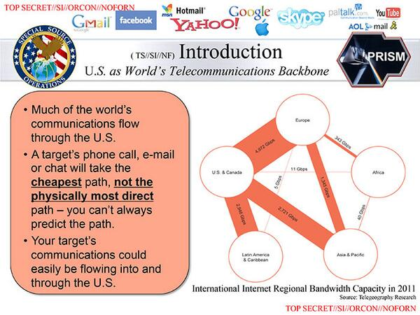

# 推文存档
生成时间: 2026-03-08 18:30:36

---

> NaiveProxy第一次能在安卓上运行了，由SagerNet提供的支持 https://github.com/SagerNet/SagerNet

-- [gfwrev (1)](https://x.com/gfwrev/status/1396015162448965639), 2021年05月22日 08:08:46

---

> 初步评价XTLS：1)只能兼容1:1连接模型，从而引出所有连接级和主机级的流量画像；2)若运载TLS 1.2则会暴露TLS 1.3所没有的nonce明文序列号；3)不当跨层，允许主动探针触发上游的TLS alert，与本机的TLS alert产生可分辨的RTT差异。

-- [gfwrev (1)](https://x.com/gfwrev/status/1327670741597179906), 2020年11月14日 17:52:26

---

> VLESS发明的所谓XTLS有鹦鹉问题，还需要深究

-- [gfwrev (1)](https://x.com/gfwrev/status/1312601086134345728), 2020年10月04日 03:51:00

---

> 多路复用、H/2的协议栈都应该了解一下Linux内核tcp_notsent_lowat的特性，解决复用时流量优先级调度的性能问题

-- [gfwrev (1)](https://x.com/gfwrev/status/1312600974838562817), 2020年10月04日 03:50:34

---

> 完了，Cloudflare发现QUIC并不比H2快 https://blog.cloudflare.com/http-3-vs-http-2/

-- [gfwrev (1)](https://x.com/gfwrev/status/1250388469248970752), 2020年04月15日 11:40:16

---

> https://gfw.report/blog/gfw_shadowsocks/zh.html 这个报告基本确实了2020业界标配：长度混淆（ss没有），反嗅探前端（ss是裸的），标准TLS加密栈（ss自己发明）

-- [gfwrev (1)](https://x.com/gfwrev/status/1214905361045475334), 2020年01月08日 13:43:04

---

> 各TLS翻墙协议的ClientHello指纹识别情况调查 https://gist.github.com/klzgrad/25b2612d266a450abca6129a7ca595a4

-- [gfwrev (1)](https://x.com/gfwrev/status/1193203634135109632), 2019年11月09日 16:28:09

---

> Caddy的QUIC前向代理能用已经有一段时间了（尽管需要一点修改），但是它跟Chrome交互的GQUIC在拥塞控制上太保守，跟H2代理相比只能缓慢填到一半的带宽，性能上没有什么优势。也可能是标准开发期间保守测试的原因。

-- [gfwrev (1)](https://x.com/gfwrev/status/1109770169373483008), 2019年03月24日 10:53:21

---

> How to create a simple HTTP/2 proxy real quick https://github.com/klzgrad/naiveproxy/wiki/Caddy-Proxy-HOWTO

-- [gfwrev (1)](https://x.com/gfwrev/status/1085794662072311808), 2019年01月17日 07:03:15

---

> 下面评价几个今天的翻墙协议。不过首先声明，今天能用的协议就是好协议；但是今天能用不等于明天能用，因此这仅限于理论讨论。

-- [gfwrev (1)](https://x.com/gfwrev/status/1081802626243514370), 2019年01月06日 06:40:19

---

> 取代TLS/HTTP/2的下一代协议QUIC看目前的进度希望在一两年内能完成标准化。Chrome早就内置了QUIC代理，但现在市面上还没有公开的QUIC代理服务器，Caddy有望，不过它暂时还不工作。至于KCP也号称是UDP上的高性能协议，但它连协议定义都没有，于是无法评价。

-- [gfwrev (1)](https://x.com/gfwrev/status/1081814786684272640), 2019年01月06日 07:28:38

---

> 高性能TLS的方法是连接池复用，长连接，预连接，多路复用，最终TLS握手的成本被均摊掉了。见Chrome网络栈的经验 https://web.archive.org/web/20160305002536/https://insouciant.org/tech/connection-management-in-chromium/

-- [gfwrev (1)](https://x.com/gfwrev/status/1081813999824527361), 2019年01月06日 07:25:31

---

> SS等等不使用TLS的根源来自性能架构：如果用户每一个TCP连接翻译成往外的一个连接，如果用TLS连接发起时间会很高。这反映出常见代理在架构设计上缺乏大规模生产环境的经验指导。SS/V2ray还在努力实现Fast Open的时候，Chrome已经把Fast Open的代码删除了，因为现实世界这个功能不工作。

-- [gfwrev (1)](https://x.com/gfwrev/status/1081813043619684353), 2019年01月06日 07:21:43

---

> TLS的确比自行发明密码协议好一些，但是TLS协议栈的被动指纹特征又非常明显，go有它的指纹特征，openssl等等特征都不同。Tor之前被查封就是因为使用了固定的特征，后来用了Firefox的特征依然被一款防火墙查封，原因是：没人用（该版本）的Firefox。这里唯一的办法是跟进主流浏览器的特征。

-- [gfwrev (1)](https://x.com/gfwrev/status/1081811232884051968), 2019年01月06日 07:14:31

---

> 在反主动指纹识别上，Shadowsocks也出过错，解决方法是尽量减少用户认证前透露的信息。但根本问题不在于能少透露多少信息，问题在于这几个代理工作在传输层上，但传输层上的常见实现及其特征是很少的。唯一彻底避免主动指纹识别的方法是用一个真的常见应用（例：nginx）作为前端。

-- [gfwrev (1)](https://x.com/gfwrev/status/1081809143965528064), 2019年01月06日 07:06:13

---

> ShadowsocksRR之后试图实现若干“高级”的伪装协议。网络安全界早有结论：鹦鹉已死。模仿协议反而会暴露出更多可以检测的特征。例如SSR里面歪用TLS的技巧，和V2ray里面的http伪装，本身都暴露更大的特征。

-- [gfwrev (1)](https://x.com/gfwrev/status/1081806410575314944), 2019年01月06日 06:55:21

---

> ShadowsocksR在这基础上添加了包长度混淆。一个明显的反驳是，如果包长度的随机分布呈现一个明显的均匀分布，那一个简单的熵就可以检测出来。对此，不如直接从运载流量中提取分布，就没有内生熵特征的问题了。包长度混淆这个技术依然是合理的。

-- [gfwrev (1)](https://x.com/gfwrev/status/1081805524226588672), 2019年01月06日 06:51:50

---

> Shadowsocks目前没有包长度混淆，要检测它并不需要机器学习，手动写一个代码都可以做到。原因是它运载的流量一大部分是TLS，而TLS握手有固定的包长度，SS又再额外添加了一些包头，形成了独特的包长分布，因此运载TLS流量的SS是极易检测的。当然，今天裸奔暂时还没什么问题。

-- [gfwrev (1)](https://x.com/gfwrev/status/1081804478838263808), 2019年01月06日 06:47:41

---

> Shadowsocks首先开启了易用的用户态加密TCP代理的模范。但是很快就出了好几个密码工程的错误，这提醒我们没事不要重新发明密码协议，为何不用TLS呢？V2Ray的一部分也在多少重新发明密码协议。

-- [gfwrev (1)](https://x.com/gfwrev/status/1081803699146477571), 2019年01月06日 06:44:35

---

> Je sais bien, mais quand même https://x.com/gfwrev/status/937967737824882688/photo/1

-- [gfwrev (1)](https://x.com/gfwrev/status/937967737824882688), 2017年12月05日 08:51:49

---

> 关于文中的猜想2我有一个微小的评论。我觉得这个新行为可能跟GFW集群的计算模式有关，可能模式匹配因为专有硬件的部署而比TCP状态维护更便宜，因此计算模式是先模式匹配再来宽松地检查TCP连接状态是否有效，而不是反过来。

-- [gfwrev (1)](https://x.com/gfwrev/status/926250419822776321), 2017年11月03日 00:51:23

---

> Wang et al.根据对GFW状态机的新分析提出了新的TCP层穿墙方法，经过广泛测试成功率高达98%。他们把代码发布在了 https://github.com/seclab-ucr/INTANG

-- [gfwrev (1)](https://x.com/gfwrev/status/926248607501770752), 2017年11月03日 00:44:11

---

> http://www.cs.ucr.edu/~krish/imc17.pdf 刚发表的论文对GFW的TCP状态机进行了最新的分析，质量极高。Wang et al.祝贺你们！

-- [gfwrev (1)](https://x.com/gfwrev/status/926243253531369473), 2017年11月03日 00:22:55

---

> 自由门无界成功是因为他们真正提供了网络访问的自由，而不是一两个媒体的扩音器。他们不成功是因为政府资助限制了他们的基础设置规模。成功的翻墙模式需要的是群众自开发自运营、分散而多样化、非标准协议、易建立易转移的代理/VPN基础设施。每重造一个轮子，墙就多一份头疼，翻墙就多一个希望。

-- [gfwrev (1)](https://x.com/gfwrev/status/536623615903821824), 2014年11月23日 20:53:34

---

> 利用公用服务翻墙并不是新鲜想法，自由门无界系列就利用GWT、gdoc、亚马逊S3甚至雅虎和msn的profile来隐匿传递代理服务器信息。区别在于他们自己搭建代理网络基础设施，公用服务只用来接头，误伤非常局部；而“连带自由”的手段是利用别人的基础设施最大化连带伤害造成轰动效应。

-- [gfwrev (1)](https://x.com/gfwrev/status/536623593946636290), 2014年11月23日 20:53:29

---

> 低技术翻墙对整个翻墙大局有害。公然传播hosts，在公共网络服务大量放置静态镜像，故意挑起幼稚粗放的审查指令造成广泛误伤，最终让墙去完善一些考虑过但未实现的简单的技术细节。“连带自由”项目明显没有伦理委员会把关。

-- [gfwrev (1)](https://x.com/gfwrev/status/536623565794463744), 2014年11月23日 20:53:22

---

> 朴素VPN，一种VPN新玩法 https://gist.github.com/klzgrad/5661b64596d003f61980

-- [gfwrev (1)](https://x.com/gfwrev/status/534152135668432896), 2014年11月17日 01:12:47

---

> DNS穿墙奇技淫巧：https://gist.github.com/klzgrad/f124065c0616022b65e5。上次gfw-looking-glass飞指针之后GFW就再也不认真处理DNS域名压缩指针了，但是Google DNS认真处理。于是有多种玩法，在域名里加个指针指向奇怪的地方，便不认得了。

-- [gfwrev (1)](https://x.com/gfwrev/status/533564218113789952), 2014年11月15日 10:16:37

---

> FOCI14论文算出来一个集群有360个节点，这好像跟以前查到的曙光4000L 360节点一模一样，巧合？

-- [gfwrev (1)](https://x.com/gfwrev/status/531773456556511232), 2014年11月10日 11:40:46

---

> greatfire的杰作就是http://sinaapp.co这种玩意来误伤GFW天真的模式匹配。GFW是谁开发的，开发的时候只是作个意思留些漏洞，大家私下翻一翻得过且过。你要找国务院立个项，正规军来搞Collateral Freedom，那就军备竞赛吧。

-- [gfwrev (1)](https://x.com/gfwrev/status/531772270285705216), 2014年11月10日 11:36:03

---

> 关于2014年1月21日网络故障，一直没有看见有人发出tcpdump来，那才是直接证据。从8.8.8.8解析出错误结果不说明问题，也许是BGP错误；从黑洞解析出错误结果才能说明GFW在注入。FOCI14论文作者一直监控竟然没发现有任何注入。

-- [gfwrev (1)](https://x.com/gfwrev/status/531769327952084992), 2014年11月10日 11:24:22

---

> 比如这个“Internet Censorship in China: Where Does the Filtering Occur?”。结论错了。mongol定位GFW，也是错的。原因是他们靠TTL定位，但是一旦丢一个包TTL就跑里面去了。

-- [gfwrev (1)](https://x.com/gfwrev/status/531764950780633088), 2014年11月10日 11:06:58

---

> FOCI14关于DNS污染那个论文的重要结论：以前的一些研究是错的，不存在省级GFW；2014年1月21日网络故障非GFW所为；（因为greatfire的杰作）GFW改用了更严格的匹配模式；GFW每个集群有360个节点，每个节点每秒处理2800个DNS包。

-- [gfwrev (1)](https://x.com/gfwrev/status/531761748039438336), 2014年11月10日 10:54:15

---

> 我们的工作被引用于USENIX FOCI'13的论文“Towards Illuminating a Censorship Monitor's Model to Facilitate Evasion”。其主要发现是GFW漏洞很多，但都可以修，花费各异，只是权衡。我们以前有类似看法。

-- [gfwrev (1)](https://x.com/gfwrev/status/521977746109792256), 2014年10月14日 10:56:07

---

> 内核3.18将推出Foo over UDP功能，可用iproute2工具在UDP上建隧道，建VPN。西厢计划三年前基于iptables实现的UDPENCAP具有同样功能，现在可以退役了。

-- [gfwrev (1)](https://x.com/gfwrev/status/517952460259078144), 2014年10月03日 08:21:04

---

> 3.13 nftables很有前途，写一些字节码可以直接替代xt_gfw.c，不过目前还不能发包改包。

-- [gfwrev (1)](https://x.com/gfwrev/status/425780932738437120), 2014年01月22日 00:04:19

---

> Google Ideas主管Jared Cohen于2011年加入谷歌，前后曾在伊朗边境、阿富汗、黎巴嫩、印度从事政权更迭及宣传工作。在加入谷歌之前他是国务院的高级顾问，为希拉里和赖斯提供咨询。http://wikileaks.org/Op-ed-Google-and-the-NSA-Who-s.html

-- [gfwrev (1)](https://x.com/gfwrev/status/411761698039549952), 2013年12月14日 07:36:53

---

> 早在2008年即已通过QUANTUM系统将目标重定向到FOXACID专门攻击系统，然后通过漏洞把目标主机拿下。

-- [gfwrev (1)](https://x.com/gfwrev/status/403999569366618112), 2013年11月22日 21:32:57

---

> 斯诺登文件显示NSA使用QUANTUM系统同样以流量重定向方式中间人了Google https://www.documentcloud.org/documents/785152-166819124-mitm-google.html

-- [gfwrev (1)](https://x.com/gfwrev/status/403997634391588864), 2013年11月22日 21:25:16

---

> NSA的QUANTUM系统通过国内路由管控、全球路由劫持来进行流量精确重定向，然后进行包注入、内容替换等中间人攻击。这部分解释了PRISM的架构。相比之下GFW公开试验劫持Github显得比较业余。http://www.wired.com/opinion/2013/11/this-is-how-the-internet-backbone-has-been-turned-into-a-weapon

-- [gfwrev (1)](https://x.com/gfwrev/status/403996441346969600), 2013年11月22日 21:20:32

---

> CNCERT/CC的防火长城就是US-CERT的爱因斯坦计划。

-- [gfwrev (1)](https://x.com/gfwrev/status/345421311180423168), 2013年06月14日 06:03:52

---

> NSA为什么要拿HKIX？如果按上个幻灯片的说法，拿到HKIX就可以轻易让特定流量绕路美国，然后截获保存。

-- [gfwrev (1)](https://x.com/gfwrev/status/345368522744033280), 2013年06月14日 02:34:07

---

> 研究研究PRISM的架构 https://x.com/gfwrev/status/343214324547997697/photo/1

-- [gfwrev (1)](https://x.com/gfwrev/status/343214324547997697), 2013年06月08日 03:54:06

---

> 最近发现@clowwindy开发的shadowsocks加密代理很有意思，非常轻量级的几百行python，简单有效便于部署，开发移植灵活。灵活的开发方式对于变动不居的墙是必要的。

-- [gfwrev (1)](https://x.com/gfwrev/status/332899275849736192), 2013年05月10日 16:45:46

---

> 推荐GFW研究者 @fqrouter 及其(同名)开源项目 http://fqrouter.tumblr.com/ 我看过他的研究，全面严谨，值得关注。

-- [gfwrev (1)](https://x.com/gfwrev/status/332891740287692800), 2013年05月10日 16:15:50

---

> 中间人忽然停掉了？

-- [gfwrev (1)](https://x.com/gfwrev/status/295157312224636928), 2013年01月26日 13:12:41

---

> 这是一个广泛流传的误读。其实原因是当时月光博客在传播一种使用python的翻墙方法。"@ghosTM55: 因为Python的版本出到了2.6.4 RT @janusle: @ghosTM55 那他们为啥当年要封http://python.org 啊？那上面什么都没有啊。"

-- [gfwrev (1)](https://x.com/gfwrev/status/293923048158003200), 2013年01月23日 03:28:10

---

> 对着一个无稽之谈认真得犯起自我审查病来。如果我是方滨兴或黄澄清要笑死了。QT “@cao_jian: 探测gfw节点的moongo脚本…在github上，…讨论板上唯一的论题居然是几个中国程序员在要求作者停止这个项目 https://github.com/mothran/mongol/issues/1 …”

-- [gfwrev (1)](https://x.com/gfwrev/status/282525317300633600), 2012年12月22日 16:37:39

---

> 黄澄清 1995年中国工程院办公厅处长。1998年信息产业部电信管理局处长。现任国家计算机网络与计算机管理中心副主任（副局）兼任信息产业部互联网应急协调处理办公室副主任，中国互联网协会常务理事、秘书长；中国通信学会互联网应用工作委员会副主任委员；文化部进口进口审查委员会委员。

-- [gfwrev (1)](https://x.com/gfwrev/status/276896028093992960), 2012年12月07日 03:48:52

---

> GFW对于网民无论是在网络控制上还是政治保障上都有压倒性的优势。它唯一的弱点就是它一切动作的基本还是检测。既然如此，继续这个猫鼠游戏才是争取空间的最好方式。从这些年GFW技术的巨变不难看出，这只猫的实力越来越强。我们的时间很有限，不能浪费在无谓的事情上。

-- [gfwrev (1)](https://x.com/gfwrev/status/271099318587506688), 2012年11月21日 03:54:48

---

> 233 愚公拆墙 ps. 我爸爸都不知道我干过啥。 RT @aqaqaqq: 这辈子一定要有个儿子，…买电脑先卸掉win，从小就是Geek。他开始学习你用过的语言，也不全是为了应付你。一转眼他长大了，有天回来说老爹我把墙拆了。你笑着拿出一瓶烧酒：前天我就猜是你干的，…。

-- [gfwrev (1)](https://x.com/gfwrev/status/229877809508646912), 2012年07月30日 09:55:15

---

> 本着以备急用的目的看了如何进入美国大使馆：http://iipdigital.usembassy.gov/st/chinese/texttrans/2012/05/201205034977.html（中文）http://iipdigital.usembassy.gov/st/english/texttrans/2012/05/201205024923.html（英文），简而言之借口是受伤。看来自保需要有创意。

-- [gfwrev (1)](https://x.com/gfwrev/status/198043600204996608), 2012年05月03日 13:37:28

---

> 把这三个地区的GFW并列起来看，背后的目的是统一的。这样说来可以看看google有没有走广东GFW的IP（例如从广东片区访问google香港）看看gmail ssl封锁在不在。

-- [gfwrev (1)](https://x.com/gfwrev/status/191076488278323201), 2012年04月14日 08:12:39

---

> 对GFW像我党一样坊间传闻捕风捉影有何意义？4月5日晚-4月6日上午GFW广东TCP无差别RST、4月12日上午GFW上海北京针对TCP丢包，光明正大说出来。

-- [gfwrev (1)](https://x.com/gfwrev/status/191071712723484672), 2012年04月14日 07:53:40

---

> 方某所说网络独立权中的域名解析部分是想反对DNSSEC体系“强行”指派的根密钥？管辖权最后一句自我吐槽DNS污染潜在一些亚洲欧洲国家的域名解析系统。（例如韩国kr一级域名在GFW的DNS污染攻击范围内）整个幻灯片仅让我感到身体略有不适。

-- [gfwrev (1)](https://x.com/gfwrev/status/137185960659140608), 2011年11月17日 15:10:56

---

> 官府给我赠送两枚鱼饵。第一枚：http://img.ly/8uth http://pastebin.com/pBMTVqrn 第二枚：http://img.ly/8utk http://pastebin.com/BMt13Xhx 只可惜我不收礼。

-- [gfwrev (1)](https://x.com/gfwrev/status/115085824663625728), 2011年09月17日 15:32:53

---

> 另外@iGFW跟我说他因为安全问题长期停推了。

-- [gfwrev (1)](https://x.com/gfwrev/status/111815761592455168), 2011年09月08日 14:58:49

---

> 感谢Paul Liu，west-chamber竟然进了Debian testing。必须认真考虑近期整理一下代码和更新指纹了。

-- [gfwrev (1)](https://x.com/gfwrev/status/111812631827980288), 2011年09月08日 14:46:23

---

> GFW（北京）也只是一个单位。9-12层曙光机房里来来回回都是穿着防辐射大褂的工作人员。到处都是刷卡的门禁。机房里的监测室就像电视里放的那样。院子里住着保卫部队的两层小楼和菜地。正在远去的哈工大和中科院的民工，北邮的血液越来越多。

-- [gfwrev (1)](https://x.com/gfwrev/status/111587938168619009), 2011年09月07日 23:53:32

---

> http://www.youtube.com/watch?v=L_Wu1HlZbBk 亮点在40秒

-- [gfwrev (1)](https://x.com/gfwrev/status/105905304423763969), 2011年08月23日 07:32:46

---

> 以前靠TCP连接重置的阻断方式很精细，有人论过如何利用其进行DoS（如何忽略防火长城）；如果开始用网络层阻断，威力过大，被利用后果更严重。

-- [gfwrev (1)](https://x.com/gfwrev/status/70088700092088321), 2011年05月16日 11:30:22

---

> GFW是耗费无数￥￥￥用来“管理和控制”互联网的啊，要是断网和白名单能解决问题还要GFW作甚。

-- [gfwrev (1)](https://x.com/gfwrev/status/70087894068494336), 2011年05月16日 11:27:10

---

> 网络层阻断粒度是不是太大了？GFW这么搞不是自找DoS嘛。相信这不是它想要的结果。

-- [gfwrev (1)](https://x.com/gfwrev/status/69757397559808000), 2011年05月15日 13:33:54

---

> Skype登录证书被劫持（二） http://is.gd/gk6Am3 dns 污染，目前可以用tcp 做dns 解析的方式绕过。

-- [gfwrev (1)](https://x.com/gfwrev/status/62019256564449280), 2011年04月24日 05:05:17

---

> GFW还在就不会物理断网。GFW研发得越好，网络连接性越有保障。

-- [gfwrev (1)](https://x.com/gfwrev/status/46067036610248705), 2011年03月11日 04:36:52

---

> 从约3月2日迄今，GFW持续对Google若干使用安全连接的网络服务在路由器层次以十分钟周期丢包为手段进行针对性的网络劣化。可以证实是GFW所为。不同ISP和IP地址表现可能有所差异。尚不清楚其目的是测试动态路由器配置系统还是针对性的骚扰。Google应尽早反应。

-- [gfwrev (1)](https://x.com/gfwrev/status/45762738911330304), 2011年03月10日 08:27:41

---

> Google的IP段公开可查，GFW才不收集，对着一个个/16的段就上了。抽风是每个IP好一会儿封一会儿，有人以为针对特定IP，换IP有效，只不过是概率事件。 qt "@liruqi: @gfwrev 会不会只是收集Google ip, + 端口做判断？"

-- [gfwrev (1)](https://x.com/gfwrev/status/43159030226628608), 2011年03月03日 04:01:29

---

> GMail也因Google不同IP 443端口间歇性被封间歇性不能正常打开。以前感觉封GMail很遥远么？

-- [gfwrev (1)](https://x.com/gfwrev/status/43154225148080128), 2011年03月03日 03:42:23

---

> GFW封禁google ssl此举象征意义远超过当前影响。意味着在几百Gbps的骨干网上GFW已经从旁路分光的入侵检测系统升级到可以进行封禁的防火墙。一旦技术成熟，显而易见的炮灰就是ssh。//方老师不封则已，一口气就要挂掉6个VPN，还不费劲儿！

-- [gfwrev (1)](https://x.com/gfwrev/status/43008424564371456), 2011年03月02日 18:03:02

---

> 下午中国间歇性无法使用google ssl，浏览器显示连接超时，应为电信、联通在国际入口丢弃来自66.249.89.104:443的TCP包。然而各地电信、联通步调统一，并不单纯。

-- [gfwrev (1)](https://x.com/gfwrev/status/42899165499490304), 2011年03月02日 10:48:52

---

> “出行动态信息平台”可以帮助流行病学预测、城市交通规划、人群/个人行为监视。 08年就有研究 http://goo.gl/YxapB 发现一般人的每日出行规律很容易预测。这张纸我还读过，没想到能为老大哥所用。

-- [gfwrev (1)](https://x.com/gfwrev/status/42785104791076864), 2011年03月02日 03:15:38

---

> 任何的网络服务提供者，如果你没有把日志关掉就不要号称秘密、匿名、安全。

-- [gfwrev (1)](https://x.com/gfwrev/status/31338430105395200), 2011年01月29日 13:10:38

---

> 至于联通，实际上我只发现了它接入了两地的GFW。以前没有做相关实验，现在也没有机会了，不妨公布一下联通GFW的内网IP（纯蛋疼）。北京联通GFW：网关：10.54.13.254、第二跳：10.54.15.1；上海：10.52.13.254、10.52.15.120

-- [gfwrev (1)](https://x.com/gfwrev/status/19765574561173504), 2010年12月28日 14:44:14

---

> 联通能上google的这那那这完全是因为联通上接GFW的架构渣到不行以至于GFW都重置不过来。在这个国家以为联通有多好叫做too naive, sometimes stupid。

-- [gfwrev (1)](https://x.com/gfwrev/status/19757456276066304), 2010年12月28日 14:11:59

---

> .google.com是关键字、youtube、picasaweb一直都是关键字。联通GFW抽风不新鲜。RT @scavin: 今天 GFW 抽风，部分地区 Google Yahoo 全被重置，部分地区 Youtube Picasweb 可直接访问...

-- [gfwrev (1)](https://x.com/gfwrev/status/19729384399183872), 2010年12月28日 12:20:26

---

> Google已经被GFW。type2 keyword: .google.com。mail.google.com的443端口还没有被封

-- [gfwrev (1)](https://x.com/gfwrev/status/19708193961672705), 2010年12月28日 10:56:14

---

> GFW干扰google即时搜索的HTTP关键字：ww.google. && /complete/search（关键字中是2个w，我没有打错）。在寻找关键字的过程中，发现GFW重写了TCP协议栈，可能是在测试系统。蛋疼是病得治。

-- [gfwrev (1)](https://x.com/gfwrev/status/9205653587365888), 2010年11月29日 11:22:53

---

> 2006年国务院颁布的《信息网络传播权保护条例》第四条规定：“为了保护信息网络传播权，权利人可以采取技术措施，任何组织或者个人不得故意避开或者破坏技术措施，……”//不自觉脑补了《信息网络传播禁止条例》第四条

-- [gfwrev (1)](https://x.com/gfwrev/status/8789749187743744), 2010年11月28日 07:50:14

---

> Liu Jinyuan and scholarzhang are good friends. 你們懂的。how to build scholarzhang for android: http://goo.gl/XvOuu mnt by @tewilove

-- [gfwrev (1)](https://x.com/gfwrev/status/803856921403392), 2010年11月06日 06:57:09

---

> 对抗GFW的定义是什么。从目的论是提高网站的可访问性，从手段论是发现让GFW无效的技术措施。我已知的是没有一种广泛可用易用永远不可防范的技术手段能突破GFW，至于服务方人工换ip换dns买证书这些牵扯太多人的因素的，无法比较。

-- [gfwrev (1)](https://x.com/gfwrev/status/29443475564), 2010年11月02日 05:29:28

---

> GFW地图炮一例：封锁Edgecast CDN造成以下网站受影响jquery，wordpress，gravatar，tumblr，technorati，…，webqq，t.qq.com，gov.cn via @bitinn: http://is.gd/g6yh2 Collater

-- [gfwrev (1)](https://x.com/gfwrev/status/27721009408), 2010年10月18日 10:15:37

---

> gfw-looking-glass.sh打印出来的是gfw某块内存的样子。

-- [gfwrev (1)](https://x.com/gfwrev/status/25222642896), 2010年09月22日 15:45:15

---

> $SOME_IP: 在国内的随便选一个国外的不在线的ip，反之亦然。

-- [gfwrev (1)](https://x.com/gfwrev/status/25221199247), 2010年09月22日 15:28:08

---

> gfw-looking-glass.sh: while true; do printf "\0\0\1\0\0\1\0\0\0\0\0\0\6wux.ru\300" | nc -uq1 $SOME_IP 53 | hd -s20; done

-- [gfwrev (1)](https://x.com/gfwrev/status/25220534979), 2010年09月22日 15:20:20

---

> GFW对@cathayan有什么特殊的兴趣？有一个特殊的域名*.phx.ro，被污染了。不过污染方式不是伪造地址，而是伪造CNAME重定向到cathayan.org。

-- [gfwrev (1)](https://x.com/gfwrev/status/25213861322), 2010年09月22日 14:02:12

---

> GFW在反病毒方面的作用一例：Win-Trojan/Buzus.98304.X所访问的几个.info域名都被污染了。

-- [gfwrev (1)](https://x.com/gfwrev/status/25212452351), 2010年09月22日 13:45:09

---

> 发现被污染域名一个4gyt.me。评语：华农的陈同学，哀你之不幸，怒你之不智，为什么要把真qq号写在域名whois里？“挂牌督办”的“周密细致的网上调查取证”=whois到qq号，找疼讯要ip，找华农isp要网络帐号用户名，找华农宿管要房间号。

-- [gfwrev (1)](https://x.com/gfwrev/status/25201830040), 2010年09月22日 11:08:50

---

> type2 keyword: search && 钓鱼岛  
> 自古以来中国的一部分土地就在长城之外。应该这样吐槽么？

-- [gfwrev (1)](https://x.com/gfwrev/status/24733080414), 2010年09月17日 05:24:00

---

> 现猜测@iGFW所谓重大突破有两种可能性：与公安、国安挂钩的中心化定点监听系统，用动态路由来实现虚拟搭线；通过对（必然为数不少的）低安全配置用户中间人攻击监听并检测加密内容，进行抽样统计，辅以流量分析，以较低的误报率自动发现用于翻墙的公用加密代理（SSH/VPN）。

-- [gfwrev (1)](https://x.com/gfwrev/status/24668078466), 2010年09月16日 14:24:20

---

> 有能力自己做实验改代码是可以改改scholarzhang的代码继续用的，别的不说了

-- [gfwrev (1)](https://x.com/gfwrev/status/21043783967), 2010年08月13日 07:00:22

---

> 看来scholarzhang被GFW干掉了，对方是国家机器，硬拼无用 cc @ablozhou

-- [gfwrev (1)](https://x.com/gfwrev/status/21043047050), 2010年08月13日 06:45:06

---

> 大家对这支股票有什么看法？“启明星辰” 申购代码：“002439” 发行价：25.00元。网上申购时间：2010 年6月7日

-- [gfwrev (1)](https://x.com/gfwrev/status/15574688834), 2010年06月06日 19:13:03

---

> 2010年CNCERT中国信息安全技术公开赛--正则表达式匹配技术评比大赛 http://goo.gl/nfKB

-- [gfwrev (1)](https://x.com/gfwrev/status/15551792034), 2010年06月06日 12:09:18

---

> 理清GFW物理位置上的关系：GFW在北京上海广东三地分别有交换中心、运行三份GFW；教育网有一实验用途GFW，正体不明，与北京GFW关系不明，流量出口与电信网通不同。北京上海广东三地的GFW在电信、联通线路上的流量分别处理、有各自的流量出口。

-- [gfwrev (1)](https://x.com/gfwrev/status/13741136348), 2010年05月10日 18:25:06

---

> 电信线路GFW TYPE2BP、TYPE2BS型RST/ACK换成了TYPE2AP和TYPE2AS（在电信、网通变成TYPE2B之后教育网一直是TYPE2A）。看来是用教育网的GFW的程序升级了北京GFW的程序。

-- [gfwrev (1)](https://x.com/gfwrev/status/13740707172), 2010年05月10日 18:15:14

---

> 公布接入线路是对GFW折腾本人的回敬。目前那几个GFW发包走的路由器是专用的，以后不知道。GFW的存在取决于大部分人的想法，@gfwrev或者老大哥都不能指望。请大家自己开辟一块地方认真讨论吧。twitter不是讨论问题的地方。

-- [gfwrev (1)](https://x.com/gfwrev/status/13308524708), 2010年05月03日 14:35:52

---

> 以上说的接入路由是指GFW的伪造包是以这个路由为网关发到公网的。如果这条线路上出问题，GFW就成了哑巴。

-- [gfwrev (1)](https://x.com/gfwrev/status/13287100285), 2010年05月03日 04:33:07

---

> GFW在北京电信的接入路由是219.141.134.25。在电信的同学真的不要错过机会啊，手中拿着那根网线的感觉是多么美妙，那种好像完全不是自己的意识的感觉。

-- [gfwrev (1)](https://x.com/gfwrev/status/13287057702), 2010年05月03日 04:32:04

---

> 有条件的同学抚摸GFW接入118.84.193.194的网口合影留念吧。采蘑菇的冲动多想体验一下。。

-- [gfwrev (1)](https://x.com/gfwrev/status/13251542562), 2010年05月02日 15:36:33

---

> 值此《中华人民共和国保守国家秘密法》修订之际，透露一项国家秘密：GFW在上海电信的接入路由为118.84.193.194。请方便的人士自行研究对策。

-- [gfwrev (1)](https://x.com/gfwrev/status/13250009348), 2010年05月02日 15:05:09

---

> 刚才搞错了。是GFW在教育网维护了一个略有不同的墙。

-- [gfwrev (1)](https://x.com/gfwrev/status/12330086627), 2010年04月17日 07:19:28

---

> 上推看后请笑而不语。另外最近大量用户反映用西厢上不去facebook，只好重复一遍：这是GFW TYPE1指纹更新导致的。绕过的方法见：《____》。

-- [gfwrev (1)](https://x.com/gfwrev/status/12178342145), 2010年04月14日 18:52:51

---

> KEYWORDS计划之EPIC FAIL：由于4.gp和ggpht.com都是关键词，lh4.ggpht.com中确实只有一个关键词，但程序会以为关键词是pht.com。

-- [gfwrev (1)](https://x.com/gfwrev/status/12176872818), 2010年04月14日 18:17:33

---

> 史上最短GFW关键词：4.gp（另一个最短关键词"罢课"的GBK码也是4字节）

-- [gfwrev (1)](https://x.com/gfwrev/status/12166149948), 2010年04月14日 14:31:51

---

> 网通你怎么只接入了两个GFW，而且还不是按照地理位置接入的？

-- [gfwrev (1)](https://x.com/gfwrev/status/11903713685), 2010年04月09日 22:05:33

---

> GFW TYPE1指纹变化

-- [gfwrev (1)](https://x.com/gfwrev/status/11890814134), 2010年04月09日 17:05:27

---

> 我国在新疆勘探到大量未使用IPv4地址，储量大约可以满足当地100年的使用需求！ RT @billzhong ipv4和石油，谁先用完呢？

-- [gfwrev (1)](https://x.com/gfwrev/status/11682929807), 2010年04月06日 05:16:05

---

> 统一GFW包记号：《入侵…》文中TYPE1更名TYPE1A、TYPE2更名TYPE2A，之后的指纹叫做TYPE1B、TYPE2B。TYPE2的包又分原发RA、继发SA、继发RA故分别追加p(rimary)和s(econdary)。

-- [gfwrev (1)](https://x.com/gfwrev/status/11635656295), 2010年04月05日 10:54:43

---

> @gfwrev 以前有人做過分析,原文: http://is.gd/bcUe3

-- [gfwrev (1)](https://x.com/gfwrev/status/11549867815), 2010年04月03日 19:36:03

---

> 维基百科中所说GFW的邮件过滤系统返回“…551 User not local;…&lt;forward-path&gt;”是可以证实的。用SMTP发送一封典型垃圾邮件就可观测到。随后GFW会RST。此重置与HTTP的区别在于GFW有伪造内容、无继发封锁。

-- [gfwrev (1)](https://x.com/gfwrev/status/11541099940), 2010年04月03日 16:06:01

---

> 是谁认为什么技术可以彻底摧毁GFW？这种技术不存在，这么想是幻想。 QT @tinyfool: 曾经有无数技术，都被认为可以彻底摧毁GFW

-- [gfwrev (1)](https://x.com/gfwrev/status/11527901695), 2010年04月03日 09:47:15

---

> 在《入侵防御系统的……》一文公布TCP指纹后GFW的新指纹虽然没有撰文公开，但由于已经失效，作一个过期的披露：ip_id = 62753 - 79 * tcp_win、ip_ttl = tcp_win % 64 + 48 (-hops)。

-- [gfwrev (1)](https://x.com/gfwrev/status/11479888988), 2010年04月02日 13:23:33

---

> 简而言之现在DNS污染识别不了了 QT @Dennis_Chang: GFW的指纹是指什么呢？

-- [gfwrev (1)](https://x.com/gfwrev/status/11418305792), 2010年04月01日 10:50:49

---

> 今天我郑重宣布，不再给伟大的中国国家防火墙添乱，请求祖国将我收编，我一定为祖国的西朝鲜化作出比方滨兴更卓越的贡献。

-- [gfwrev (1)](https://x.com/gfwrev/status/11416261106), 2010年04月01日 09:32:22

---

> Q:请问北京的红帽子是不是为gfw提供了技术支持？ A:没有。除非你说的是那家搬家公司。//gfw的操作系统是Redhat

-- [gfwrev (1)](https://x.com/gfwrev/status/11356425750), 2010年03月31日 08:13:20

---

> Q:请问西厢计划2+p2p(kad) 有没有搞头？  A:想法不错。但是西厢计划2没多大出息。 //赶紧叫isp把rp filter打开。开得了吗？吗？

-- [gfwrev (1)](https://x.com/gfwrev/status/11356317176), 2010年03月31日 08:09:06

---

> Q:GFW以后会不会实行境内网站黑名单、境外网站白名单制？ A:走向这步很难，越快走向局域网gfw越快灭亡

-- [gfwrev (1)](https://x.com/gfwrev/status/11356197379), 2010年03月31日 08:04:34

---

> RT @null: 有人说了，一行代码就搞定西厢，我也不知道是真是假。听说最近有些巨型机闲置了。//技术上说，是这样的

-- [gfwrev (1)](https://x.com/gfwrev/status/11356127660), 2010年03月31日 08:01:59

---

> 然而在所有力量当中，只有技术的发展是最难以预测的，所以是最有希望成为决定性的力量。QT @matrixboy “技术的力量永远是战胜不了政治的力量”。——spring 创初人 Rod Johnson

-- [gfwrev (1)](https://x.com/gfwrev/status/11303971143), 2010年03月30日 11:50:12

---

> 恭喜你成为第一位了解此事真正原因的人！你的记录是23分钟！ QT @zypatroon  rul分析加上 @gfwrev 的提示, 因为普通搜索存在 &gs_rfai= 语句, 其中rfa和某被墙的关键词重合.

-- [gfwrev (1)](https://x.com/gfwrev/status/11300496309), 2010年03月30日 09:49:56

---

> 这次Google被封锁只是GFW整理Google系列关键词时的一个乌龙。

-- [gfwrev (1)](https://x.com/gfwrev/status/11300403128), 2010年03月30日 09:46:11

---

> 续前前推，引起更多人注意自然是好的，也许究竟怎么回事需要一个权威的结论。只是测试关键词这样一件事情，打开浏览器、wireshark，输入搜索内容、看到RST后查到TCP会话、打开关键词测试工具输入触发URL：总共不超过两分钟。

-- [gfwrev (1)](https://x.com/gfwrev/status/11299938094), 2010年03月30日 09:28:04

---

> 西厢有N种写法，你知道么？Qt: 简单 (via NULL) Re: GFW消除西厢漏洞的难度大吗？

-- [gfwrev (1)](https://x.com/gfwrev/status/11237998695), 2010年03月29日 07:29:04

---

> 当然是在某些出入境的口做测试了 (via NULL) Re: GFW的TCP模块似乎具有了识别流量发起方是国内还是国外的功能，而且对国外流入的数据关闭了部分功能，那么为什么不全关或者全开？

-- [gfwrev (1)](https://x.com/gfwrev/status/11237891977), 2010年03月29日 07:25:01

---

> 2002年9月3日，Google.com被封锁，主要手段为DNS污染。RT @iGFW: 200209

-- [gfwrev (1)](https://x.com/gfwrev/status/11019959926), 2010年03月25日 05:26:45

---

> RT @i2p Welcome to all my new followers from China! // i2p欢迎follow他的中国推友

-- [gfwrev (1)](https://x.com/gfwrev/status/10874460869), 2010年03月22日 14:34:29

---

> GFW in your way? Have you tried #i2p yet? http://i2pproject.net/ Questions? ask us on IRC irc.freenode.net #i2p

-- [gfwrev (1)](https://x.com/gfwrev/status/10872891815), 2010年03月22日 13:59:09

---

> 目前最可能应用的就是DNS隧道，只是性能较差，需要针对上行难下行易的状况，仔细优化隧道协议和负载TCP的参数。

-- [gfwrev (1)](https://x.com/gfwrev/status/10767602633), 2010年03月20日 10:31:48

---

> 隧道出口也可能会处于封锁范围。但是反射式隧道几乎不可能封完。在不能伪造源地址的条件下，DNS隧道（dns tunnel）可以通过墙外的任意递归DNS传递数据。如果可以伪造源地址，方式就变化无穷了。

-- [gfwrev (1)](https://x.com/gfwrev/status/10767599608), 2010年03月20日 10:31:40

---

> 网络层封锁的单向特性给我们的提示便是：翻墙用隧道（比如VPN）出口不要作为NAT网关而是作为路由工作，只负担上行流量，下行流量自行直连，这样可以大大改善性能（非p2p）。 #GFW #VPN

-- [gfwrev (1)](https://x.com/gfwrev/status/10767596391), 2010年03月20日 10:31:31

---

> 不同地区的实验已经证实，网络层封锁只针对往墙外的包，往墙内的通信不受GFW影响。理论上如果骨干路由启用uRPF Loose Mode可以做到双向封锁（但是实际上目前仍然是单向，为什么不启用呢）。

-- [gfwrev (1)](https://x.com/gfwrev/status/10767592588), 2010年03月20日 10:31:21

---

> 也就是说对于一般的客户端，只要解决了上行控制流的隧道问题，下行就是直连了。这对主要需求是下载的用户性能非常有改善啊lololol

-- [gfwrev (1)](https://x.com/gfwrev/status/10663929480), 2010年03月18日 09:42:40

---

> 金盾=公安部 GFW=工信部 出洋相=￥再分配 RT @iGFW: 目前开发打墙工具的很安全，因为金盾很想看到GFW出洋相。

-- [gfwrev (1)](https://x.com/gfwrev/status/10656025887), 2010年03月18日 04:41:20

---

> http://blog.youxu.info/2010/03/14/west-chamber/ (via @mathena) 原理确实如此。文中修辞用多了。对GFW打补丁仍有担心。静观其变。

-- [gfwrev (1)](https://x.com/gfwrev/status/10495333199), 2010年03月15日 01:29:27

---

> 就是为了把原理说出来才大费周章写博讲解的。损失一个易用的穿墙方案并不要紧，我们所展示的是GFW的本质缺陷，是几乎无法通过升级来解决的。 QT &lt; @k2syfhl: 西厢计划不应该将工作原理说出来。

-- [gfwrev (1)](https://x.com/gfwrev/status/10413995178), 2010年03月13日 08:18:45

---

> 本来为TCP部分暨张某原理解释文准备了几张图，不过那文不写了，半成品放置与此：http://img.ly/DIh http://img.ly/DIf 客户端与服务端两个方向上的gfw工作方式；http://img.ly/DIi 张某对其的（一种）应对方法。

-- [gfwrev (1)](https://x.com/gfwrev/status/10387482850), 2010年03月12日 20:00:07

---

> 不是这个计划需要。而是任何人都可以为自己的小团体自架免污染DNS用。 QT &lt; @zetifree: @ufdream 请关注 @gfwrev ，他的西厢计划需要国内DNS，你那个闲置的VPS还在吗？

-- [gfwrev (1)](https://x.com/gfwrev/status/10316045364), 2010年03月11日 10:10:33

---

> 如果您愿意为突破GFW出一份力，欢迎加载西厢项目的反DNS劫持模块在国内架设递归DNS服务器。

-- [gfwrev (1)](https://x.com/gfwrev/status/10270352128), 2010年03月10日 13:13:38

---

> 原来以为不打电话就不会被追踪，结果开机就会被追踪；后来以为关了机就不会被追踪，结果关机时会被记录地点；再后来以为开机状态下拔电池不会被追踪，结果追踪器就在电池里面。 (via http://goo.gl/i2ih )

-- [gfwrev (1)](https://x.com/gfwrev/status/9437616722), 2010年02月21日 17:49:43

---

> 排名很准啊 启明星辰跟总参五十六所之间是分界线 不过中科院软件所好像没见过有参与 RT @secretaryzhang: Google Doc上的 #GFW 工程队名单，欢迎复制、转发 http://is.gd/7wbyb

-- [gfwrev (1)](https://x.com/gfwrev/status/8532040685), 2010年02月02日 06:04:37

---

> ChinaUnix总裁名叫Fan Qiang //某阴谋论者如是说

-- [gfwrev (1)](https://x.com/gfwrev/status/8497468947), 2010年02月01日 13:03:12

---

> 我心目中的 #Autoproxy - 本地运行的daemon，使用（配置、性能测量、断线重启）多种upstream代理（vpn、ssh、tor等），基于代理性能、目标地址、URL优化路由不影响系统路由表，抗污染的DNS解析和缓存，检测GFW行为并响应（自动切换路由重试、记录特征）

-- [gfwrev (1)](https://x.com/gfwrev/status/8245744305), 2010年01月26日 18:42:23

---

> 身份证号至少出生年月是正确的。拜访时请保持礼貌。 RT @totti_chen: 方滨兴人肉: 北京市海淀区知春路豪景佳苑2楼2101号230103196007175511 http://bit.ly/7VgyPE

-- [gfwrev (1)](https://x.com/gfwrev/status/8224418565), 2010年01月26日 05:35:25

---

> 方滨兴：中国黑客与外国黑客不太一样。中国黑客是又想干，又对中国的法律比较忌惮，总想找政治行为与他们的行为进行捆绑，找政治问题作挡箭牌，就开始出手。这种现象让外国人看到，中国黑客好像很有组织力量。…所以说，中国的黑客是打哪指哪。//方的言论一直有意思

-- [gfwrev (1)](https://x.com/gfwrev/status/8149141402), 2010年01月24日 13:17:45

---

> 2009年度国家科学技术进步二等奖：大规模网络安全监控数据库系统，中国人民解放军国防科学技术大学，国家计算机网络应急技术处理协调中心。//wtf?

-- [gfwrev (1)](https://x.com/gfwrev/status/7948141225), 2010年01月19日 15:04:35

---

> “破解Google Gmail的https新思路” 简而言之就是国内CA不可信任。以国家安全的名义发假证书这种事情当然做得出来。参考 http://blog.ticktag.org/2009/09/28/5122/

-- [gfwrev (1)](https://x.com/gfwrev/status/7868008706), 2010年01月17日 16:13:26

---

> 审查部门只负责政策决策，CNCERT只负责技术执行，审查部门使用CNCERT提供的网络封锁API。叫这种关系叫松耦合也好，叫用户/服务也好，叫接口封装也好，总之这不是*一个*整体性系统。

-- [gfwrev (1)](https://x.com/gfwrev/status/7560909312), 2010年01月09日 16:12:39

---

> GFW难以理解的原因，并非政府部门不承认，而是因为实际上并不存在一个叫“GFW”的整体性系统。

-- [gfwrev (1)](https://x.com/gfwrev/status/7560906470), 2010年01月09日 16:12:32

---

> 短评《中国构建超级“网络管理国境线”》：文笔优 信息详细但不全面

-- [gfwrev (1)](https://x.com/gfwrev/status/7560894340), 2010年01月09日 16:12:06

---

> 有趣。含有/的URL关键词规避方法，三合一示例：http://www.bbc.co.uk.//./zhongwen/simp/index.shtml QT @Ratoo: @yegle 那个关于 gwt 的

-- [gfwrev (1)](https://x.com/gfwrev/status/7061784196), 2009年12月26日 14:29:36

---

> 新疆的状况让人想起hacking的起源-- phreaking

-- [gfwrev (1)](https://x.com/gfwrev/status/7041207660), 2009年12月25日 20:27:30

---

> 一般性的数据销毁方法：删除数据(zero) &lt; 覆盖数据(noise) &lt; 伪造数据(pattern spoofing)

-- [gfwrev (1)](https://x.com/gfwrev/status/6792622910), 2009年12月18日 10:37:48

---

> 个人入侵防御系统广泛部署 具有基本人工智能和攻性措施 受到GFW干扰之后行使网络正当防卫权进行90秒SYN Flood警告 &gt;@goldengrape: 未来计算机史GFW code war卷

-- [gfwrev (1)](https://x.com/gfwrev/status/6192126567), 2009年11月30日 04:36:37

---

